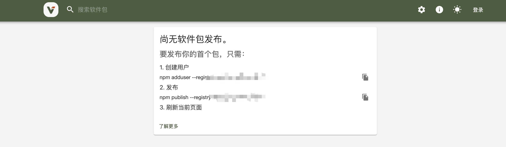

# Language

Chinese |  <a href="./doc/readme-En.md">English</a>

# 项目简介

一键式部署docker+verdaccio的npm私有库。在mac和linux系统上可以兼容使用(移除了文件权限等配置)。

# 项目结构
```
docker-verdaccio-quickly-deploy
├── config              // verdaccio相关
│   ├── config.yaml     // verdaccio配置文件 
│   └── htpasswd        // verdaccio账户管理文件
├── compose.yaml        // docker-compose配置文件
├── dockerfile          // docker构建脚本
├── storage             // 构建生成的文件,用于存储发布的包和verdaccio相关缓存
├── doc                 
│   ├──img						
│   └──readme-En.md		
├── readme.md				
└── deploy.sh           // 一键部署的脚本

```


# 操作步骤
## 前置要求
-	系统:	`mac` 或 `linux`
-	linux基本的命令行操作知识
 -	适当的docker版本(新版本一般都集成了compose工具,不需要再单独下载安装,本文档是`v28.0.4`)
- 源管理工具 `nrm` 的安装 

## 安装步骤
### 1. 克隆项目
将项目克隆到需要部署的路径下

### 2. 运行项目
#### 2.1 进入项目根目录
```bash
cd ~/verdaccio/docker-verdaccio-quickly-deploy
```
#### 2.2 运行
查看当前路径和根目录是否正确
```bash
ls
```
```bash
pwd
```
确认无误后运行脚本
```bash
sh deploy.sh
```

等待执行完成后是这个样子：


此时打开浏览器输入`http://localhost:4873/`




# FAQ
- npm login报错

  ```bash
    npm ERR! code ENYI npm ERR! Web login not supported
  ```

  这是使用npm版本9时的报错,需要添加–auth-type=legacy标志才能执行登录，将身份验证类型设置为“legacy”：

  ```bash
  npm login --auth-type=legacy
  ```

- 如何备份数据？
  在不调整其他配置的前提下备份storage文件夹即可。

- 为什么在mac环境中使用docker compose up启动不了?
  在mac环境中需要先启动 docker桌面端 开启docker环境,然后才能进行docker 构建。
  ```bash
  open -a docker // 启动桌面端docker 
  ```
