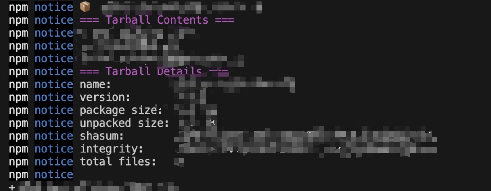

# Project Overview
A one-click deployment for a private npm registry using `Docker` + `Verdaccio`. Compatible with `macOS` and `Linux` systems (file permission configurations have been removed).

# Project Structure
```
docker-verdaccio-quickly-deploy
├── config              // Verdaccio-related files
│   ├── config.yaml     // Verdaccio configuration file
│   └── htpasswd        // Verdaccio account management file
├── compose.yaml        // Docker Compose configuration file
├── dockerfile          // Docker build script
├── storage             // Generated files for storing published packages and Verdaccio cache
├── doc                 // Documentation
│   ├── img
│   └── readme-En.md
├── readme.md
└── deploy.sh           // One-click deployment script
```

# Operation Steps
## Prerequisites
- System: `macOS` or `Linux`
- Basic Linux command-line knowledge
- Appropriate Docker version (newer versions typically include the Compose tool; this document uses `v28.0.4`)
- `nrm` (npm registry manager) installed

## Installation Steps
### 1. Clone the Project
Clone the project to the desired deployment path.

### 2. Run the Project
#### 2.1 Navigate to the Project Root Directory
```bash
cd ~/verdaccio/docker-verdaccio-quickly-deploy
```

#### 2.2 Execute the Script
Verify the current path and root directory:
```bash
ls
```
```bash
pwd
```
If correct, run the deployment script:
```bash
sh deploy.sh
```

Upon successful execution, the output will look like this:


Open a browser and navigate to `http://localhost:4873/`


npm publish




# FAQ
- **NPM Login Error**
  ```bash
  npm ERR! code ENYI npm ERR! Web login not supported
  ```
  This error occurs with npm version 9. Add the `--auth-type=legacy` flag to set the authentication type to "legacy":
  ```bash
  npm login --auth-type=legacy
  ```

- **How to Back Up Data?**
  Simply back up the `storage` folder without modifying other configurations.

- **Why Does `docker compose up` Fail to Start in macOS?** <br />
  On macOS, ensure the Docker Desktop application is running to enable the Docker environment before building:
  ```bash
  open -a docker // Start Docker Desktop
  ```
